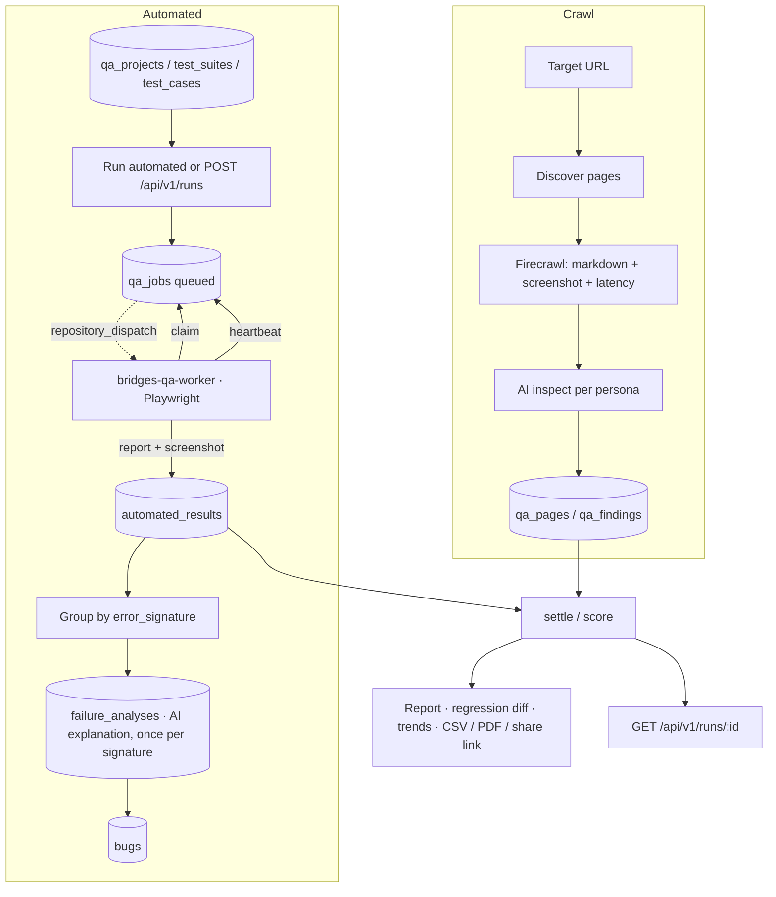

# Architecture

Two independent pipelines write into the same run/score/report layer.

## Crawl pipeline

Source: `src/lib/qa/runner.ts`, `crawler.functions.ts`, `inspector.functions.ts`, `qa.functions.ts`, `scoring.ts`.

1. The browser starts a run. `qa_runs` row is created with `kind='crawl'`.
2. **Discover** — the target URL is mapped to a page list, capped by the run's depth setting.
3. **Scrape** — pages are fetched through Firecrawl, five at a time, capturing markdown, a screenshot and the fetch latency. A failed page becomes a warning on the run, not a dead run (retry with backoff first).
4. **Inspect** — each page is inspected once per selected persona, six inspections in flight, through the AI gateway. The model receives the screenshot when one exists, so it can mark findings `observed`; otherwise findings are `inferred`.
5. **Persist** — every page (`qa_pages`) and finding (`qa_findings`) is written as it lands, so a run is never lost if the tab closes. Persistence errors surface as warnings.
6. **Score** — `computeScore` weights findings by severity, discards *inferred* visual and performance findings, normalises the penalty by `pages × personas` so deeper runs are not punished, and multiplies by crawl coverage. Any critical finding makes the verdict `block`.

## Automated pipeline

Source: `projects.functions.ts`, `queue.server.ts`, `api.public.worker.*.ts`, `failure-analysis.server.ts`, `report.server.ts`.

1. A project (`qa_projects`) holds the base URL, environment and optional test credentials. Suites hold cases; each case is an ordered list of steps validated by `src/lib/qa/steps.ts`.
2. "Run automated" (or `POST /api/v1/runs`) creates a `qa_runs` row with `kind='automated'` and one `qa_jobs` row per case. If `QA_WORKER_REPO` and `QA_WORKER_DISPATCH_TOKEN` are set, a `repository_dispatch` event nudges the worker repo. A dispatch failure never fails the run.
3. The external worker claims one job at a time via `claim_qa_job()` (`FOR UPDATE SKIP LOCKED`), heartbeats while running, and reports the verdict with evidence.
4. The report route stores the screenshot in the private `qa-evidence` bucket, writes an `automated_results` row, and closes the job.
5. **Failure analysis** — a failing result is grouped by `error_signature` (normalised error + selector, SHA-256). A new signature triggers exactly one AI call to explain it; a repeat signature only increments `occurrences`. Infrastructure `error` results are never analysed.
6. **Settlement** — when every job is settled, the SQL function `settle_qa_run()` marks the run completed and writes counts, score and verdict. The report route, the claim function's stale sweep, and its invalid-job path all call the same function, so a run cannot hang in progress.
7. **Reporting** — regression diff against the previous completed run of the project, flaky detection over 5 runs, trends, an AI executive summary that is rejected server-side if it mentions a number not in the data, CSV/PDF export and expiring share links.

## Diagram

## Boundaries

- Anything secret or privileged runs inside a `createServerFn` handler or a server route handler; `process.env` is only read there.
- Worker and public API endpoints are file routes under `src/routes/api/`, authenticated by their own bearer token, never by a user session.
- Realtime is enabled on `qa_jobs` and `automated_results`; the run page subscribes and falls back to an 8-second poll.
